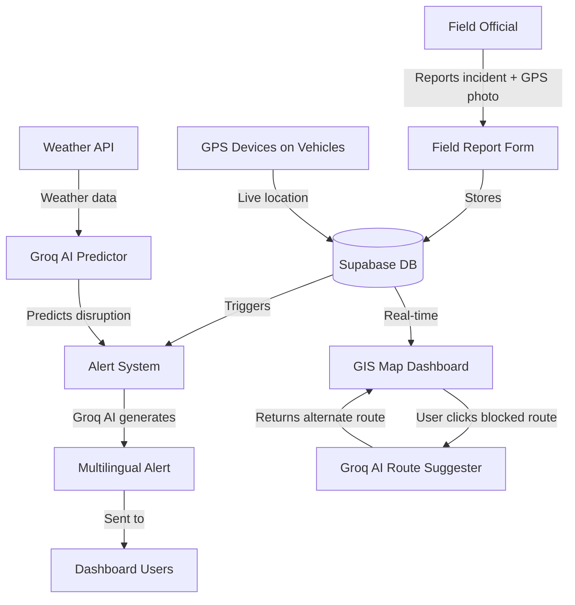

# 🚀 SIH — AI-Based Smart Logistics & Accessibility Intelligence Platform for NER

---

## 🧠 What Does the Problem Statement Actually Want?

Think of it as building **Google Maps + Weather Alert System + Supply Chain Tracker** — but specifically for the **North Eastern Region (NER) of India** (states like Assam, Meghalaya, Manipur, Mizoram, Nagaland, Tripura, Arunachal Pradesh, Sikkim).

### The Core Problem (in simple terms):
- Roads in NER break frequently due to landslides, floods, heavy rain
- Essential goods (medicines, food, fuel) get stuck or delayed
- Nobody has a **real-time view** of which roads are open/closed
- Field officials have **no easy way** to report road damage
- No AI to **predict** upcoming disruptions or suggest alternate routes

### What They Want You to Build:
A **web + mobile platform** that acts like a **logistics command center** for NER with:

| Feature | What it does |
|---|---|
| 🗺️ GIS Dashboard | Live map showing which roads/bridges are open, blocked, damaged |
| 🤖 AI Route Engine | Suggests alternate routes when a road is blocked (Groq AI) |
| 📡 Vehicle Tracker | GPS tracking of trucks carrying essential goods |
| ⚠️ Alert System | Automated alerts for blocked roads, delayed deliveries |
| 📱 Field Reporting | Field officials upload geo-tagged photos + incident reports |
| 📊 Analytics Dashboard | District-wise supply chain status, bottlenecks |
| 🌐 Multilingual Support | Notifications in local NE languages |
| 📶 Offline Sync | Works in low-network areas, syncs when connected |

---

## 🛠️ Tech Stack (Based on Your Tools)

```
Frontend:   React.js / Next.js
UI:         Stitch (for smooth UX) + Tailwind CSS
Map/GIS:    Leaflet.js or Mapbox GL JS (free tier)
Auth:       Supabase (Auth + PostgreSQL database)
AI Engine:  Groq API (llama3 / mixtral — free tier)
Weather:    OpenWeatherMap API (free)
Backend:    Node.js / Next.js API routes
Flow Diagrams: Mermaid AI
Debugging:  Antigravity (you're already using it!)
Dev:        AI Studio (for MVP code generation)
```

---

## 📋 STEP-BY-STEP BUILD GUIDE

---

### PHASE 1: Setup & Foundation (Day 1)

#### Step 1 — Project Setup
```bash
npx create-next-app@latest ner-logistics --typescript --tailwind --app
cd ner-logistics
```

#### Step 2 — Install Core Dependencies
```bash
npm install @supabase/supabase-js
npm install leaflet react-leaflet          # For GIS maps
npm install @groq-sdk/groq                 # Groq AI
npm install lucide-react                   # Icons
npm install recharts                       # Charts for dashboard
npm install socket.io-client               # Real-time updates
npm install react-hook-form zod            # Forms + validation
```

#### Step 3 — Supabase Setup
1. Go to [supabase.com](https://supabase.com) → Create project
2. Create these tables:

```sql
-- Roads / routes table
CREATE TABLE routes (
  id UUID PRIMARY KEY DEFAULT gen_random_uuid(),
  name TEXT,
  district TEXT,
  state TEXT,
  status TEXT CHECK (status IN ('open', 'blocked', 'at_risk', 'damaged')),
  coordinates JSONB,        -- GeoJSON line coordinates
  last_updated TIMESTAMPTZ DEFAULT NOW()
);

-- Incidents reported by field officials
CREATE TABLE incidents (
  id UUID PRIMARY KEY DEFAULT gen_random_uuid(),
  reported_by UUID REFERENCES auth.users(id),
  route_id UUID REFERENCES routes(id),
  type TEXT,                -- 'landslide', 'flood', 'damage', 'congestion'
  description TEXT,
  photo_url TEXT,
  lat FLOAT,
  lng FLOAT,
  severity TEXT CHECK (severity IN ('low', 'medium', 'high', 'critical')),
  created_at TIMESTAMPTZ DEFAULT NOW()
);

-- Vehicle tracking
CREATE TABLE vehicles (
  id UUID PRIMARY KEY DEFAULT gen_random_uuid(),
  vehicle_number TEXT,
  driver_name TEXT,
  cargo_type TEXT,          -- 'medicine', 'food', 'fuel', 'construction'
  origin TEXT,
  destination TEXT,
  current_lat FLOAT,
  current_lng FLOAT,
  status TEXT,
  last_ping TIMESTAMPTZ DEFAULT NOW()
);

-- Alerts
CREATE TABLE alerts (
  id UUID PRIMARY KEY DEFAULT gen_random_uuid(),
  title TEXT,
  message TEXT,
  severity TEXT,
  district TEXT,
  is_active BOOLEAN DEFAULT TRUE,
  created_at TIMESTAMPTZ DEFAULT NOW()
);
```

#### Step 4 — Get Your API Keys
| Service | Where to Get |
|---|---|
| Groq API | [console.groq.com](https://console.groq.com) → Free tier |
| OpenWeatherMap | [openweathermap.org/api](https://openweathermap.org/api) → Free 1000 calls/day |
| Supabase | Project Settings → API |
| Mapbox (optional) | [mapbox.com](https://mapbox.com) → Free 50k map loads/month |

Create `.env.local`:
```env
NEXT_PUBLIC_SUPABASE_URL=your_url
NEXT_PUBLIC_SUPABASE_ANON_KEY=your_key
GROQ_API_KEY=your_groq_key
OPENWEATHER_API_KEY=your_weather_key
NEXT_PUBLIC_MAPBOX_TOKEN=your_mapbox_token
```

---

### PHASE 2: Core Pages & UI (Day 1-2)

#### Pages to Build:
```
/                    → Landing page (public)
/login               → Auth (Supabase)
/dashboard           → Main command center (protected)
/map                 → Live GIS map
/vehicles            → GPS vehicle tracking
/incidents           → Field reports
/alerts              → Alert management
/report              → Field officials report form (mobile-friendly)
/analytics           → Charts and district-wise stats
```

---

### PHASE 3: GIS Map (Most Important Feature)

Use **Leaflet.js** with OpenStreetMap tiles (completely free):

```jsx
// components/NERMap.tsx
import { MapContainer, TileLayer, Polyline, Marker, Popup } from 'react-leaflet'

export function NERMap({ routes, vehicles, incidents }) {
  return (
    <MapContainer center={[25.5, 91.9]} zoom={7}>
      <TileLayer url="https://{s}.tile.openstreetmap.org/{z}/{x}/{y}.png" />
      
      {/* Color-coded roads: green=open, red=blocked, yellow=at-risk */}
      {routes.map(route => (
        <Polyline
          key={route.id}
          positions={route.coordinates}
          color={route.status === 'open' ? 'green' : route.status === 'blocked' ? 'red' : 'orange'}
        />
      ))}
      
      {/* Vehicle markers with live position */}
      {vehicles.map(v => (
        <Marker key={v.id} position={[v.current_lat, v.current_lng]}>
          <Popup>{v.vehicle_number} — {v.cargo_type}</Popup>
        </Marker>
      ))}
    </MapContainer>
  )
}
```

---

### PHASE 4: Groq AI Integration (The "AI" in AI Platform)

This is the **star of your demo**. Use Groq to power:

#### 4A — AI Route Suggestion Engine
```js
// app/api/route-suggest/route.ts
import Groq from 'groq-sdk'
const groq = new Groq({ apiKey: process.env.GROQ_API_KEY })

export async function POST(req) {
  const { blockedRoute, availableRoutes, cargoType, weatherData } = await req.json()
  
  const completion = await groq.chat.completions.create({
    model: 'llama3-8b-8192',  // Free, fast
    messages: [{
      role: 'system',
      content: `You are a logistics AI for India's North Eastern Region. 
                Suggest the best alternate route considering terrain, weather, and cargo type.
                Always respond in JSON format.`
    }, {
      role: 'user',
      content: `
        Blocked route: ${blockedRoute}
        Available alternate routes: ${JSON.stringify(availableRoutes)}
        Cargo type: ${cargoType}
        Current weather: ${JSON.stringify(weatherData)}
        
        Suggest the best route and explain why. Include estimated delay.
      `
    }],
    response_format: { type: 'json_object' }
  })
  
  return Response.json(JSON.parse(completion.choices[0].message.content))
}
```

#### 4B — AI Disruption Predictor
```js
// Predict which routes might get disrupted
const prediction = await groq.chat.completions.create({
  model: 'llama3-8b-8192',
  messages: [{
    role: 'user',
    content: `
      Based on this weather forecast for NER: ${weatherData}
      And historical incident data: ${recentIncidents}
      
      Which districts and routes are at HIGH risk of disruption in next 48 hours?
      Return as JSON: { high_risk_routes: [], recommended_actions: [] }
    `
  }],
  response_format: { type: 'json_object' }
})
```

#### 4C — AI Alert Message Generator
```js
// Auto-generate alert messages in multiple languages
const alert = await groq.chat.completions.create({
  model: 'llama3-8b-8192',
  messages: [{
    role: 'user',
    content: `
      Generate an emergency logistics alert for:
      Location: ${district}, ${state}
      Incident: ${incidentType}
      Affected vehicles: ${vehicleCount}
      
      Write in: English, Hindi, and Assamese.
      Return as JSON: { english: "", hindi: "", assamese: "" }
    `
  }]
})
```

---

### PHASE 5: Field Reporting (Mobile-Friendly Form)

Field officials in remote areas need a simple form to report:
- ✅ Take a photo
- ✅ Auto-capture GPS location
- ✅ Select incident type
- ✅ Works offline (IndexedDB) → syncs when connected

```jsx
// Key feature: Get GPS location automatically
const getLocation = () => {
  navigator.geolocation.getCurrentPosition(pos => {
    setLat(pos.coords.latitude)
    setLng(pos.coords.longitude)
  })
}

// Upload geo-tagged photo to Supabase Storage
const uploadPhoto = async (file) => {
  const { data } = await supabase.storage
    .from('incident-photos')
    .upload(`${Date.now()}-${file.name}`, file)
  return data.path
}
```

---

### PHASE 6: Dashboard & Analytics

Use **Recharts** for:
- District-wise connectivity bar chart
- Supply delivery timeline
- Incident heatmap by type
- Vehicle status pie chart

---

### PHASE 7: Real-time Updates

Use **Supabase Realtime** (built-in, free):
```js
// Subscribe to live road status changes
const subscription = supabase
  .channel('route-updates')
  .on('postgres_changes', { event: '*', schema: 'public', table: 'routes' }, 
    payload => updateMapInRealTime(payload))
  .subscribe()
```

---

## 🗺️ App Flow (Mermaid Diagram)



---

## 📅 Hackathon Timeline (Suggested)

| Time | Task |
|---|---|
| Hour 1-2 | Setup Next.js + Supabase + env keys |
| Hour 3-4 | Build auth (login/signup) + layout |
| Hour 5-7 | GIS Map with color-coded routes |
| Hour 8-10 | Groq AI route suggestion API |
| Hour 11-13 | Field reporting form (mobile) |
| Hour 14-16 | Dashboard + charts |
| Hour 17-18 | Alert system + real-time updates |
| Hour 19-20 | Multilingual + offline support |
| Hour 21-22 | Demo data + polish UI |
| Hour 23-24 | Testing + deployment (Vercel) |

---

## 🎯 Demo Strategy (What to Show Judges)

1. **Show the map** with color-coded roads (green/yellow/red) — instant visual impact
2. **Block a route** → Watch AI suggest alternate route in real-time (Groq)
3. **Use field report form on phone** → See it appear on dashboard instantly
4. **Show weather-based prediction** → "AI predicts Assam-Meghalaya corridor at high risk tomorrow"
5. **Show multilingual alert** — English + Hindi + Assamese
6. **Show vehicle tracker** moving on map

---

## 🚀 Deployment

```bash
# Deploy to Vercel (free)
npm install -g vercel
vercel --prod
```

Add all env variables in Vercel dashboard → Settings → Environment Variables.

---

## ⚡ Key Differentiators (What Makes You Win)

- ✅ **Real Groq AI** calls (not fake/hardcoded) — judges will test this
- ✅ **Working GIS map** with actual NER districts
- ✅ **Multilingual** (Assamese/Manipuri at minimum)
- ✅ **Offline-first** field reporting
- ✅ **Real-time** Supabase updates on map
- ✅ **Mobile-responsive** — judges will check on phones
- ✅ Demo with actual NER road/district data (seed your DB with real data)

---

> **Pro Tip**: Pre-load your Supabase DB with realistic NER data (actual district names, real road names like NH-6, NH-27, etc.) before the demo. Use Groq to generate realistic incident data if needed.
