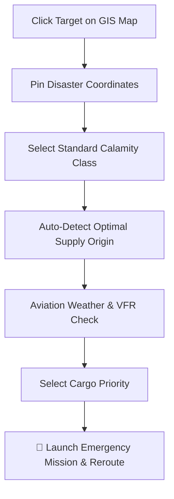
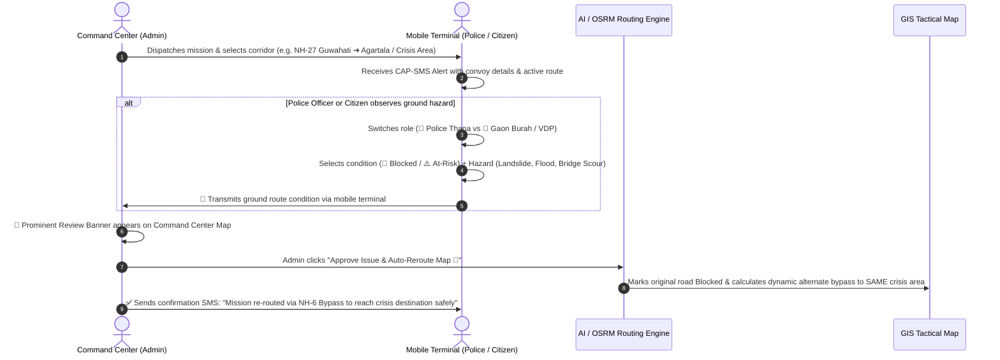

# 🗺️ NERA — Live GIS Tactical Map & Operations Documentation
**North East Disaster Logistics & Resilient Routing Platform**  
*Compliant with NDMA, NIDM, DGCA, MoRTH & Ministry of Home Affairs (MHA) Standard Operating Procedures.*

---

## 📌 Executive Summary

The **Live Map Section** (`/map`) serves as the operational nerve center of **NERA**. It synthesizes real-time satellite imagery, elevation data, 8-state administrative boundaries, police jurisdiction rosters, weather radar feeds, and AI risk prediction algorithms into an interactive, multi-layered Tactical Command Console.

---

## 🏛️ 1. Architecture & Layout Blueprint

```
┌────────────────────────┬──────────────────────────────────┬────────────────────────┐
│  1. LEFT CONTROL DECK  │      2. CENTER LIVE GIS STAGE     │ 3. RIGHT TACTICAL DECK │
│  • Base Map Switcher   │  • High-Precision Vector Polylines│ • Active Corridor HUD  │
│  • District Boundaries │  • Pinned Disaster Epicenters    │ • Transport Class AI   │
│  • 8-State Filter      │  • Police Thana VHF Nodes        │ • Heli-Lift Diagnostic │
│  • Tactical Overlays   │  • Live Fleet Convoy Telemetry   │ • Bridge Axle Guard    │
│  • Quick Route Presets │  • VAP Roadhead Staging Points   │ • Cold-Chain Timer     │
└────────────────────────┴──────────────────────────────────┴────────────────────────┘
```

---

## 🛰️ 2. Multi-Layered GIS Engine Capabilities

### A. Base Map Layer Switcher
1. **🗺️ Google Maps (Street & Roads)**: High-clarity road vector map showing national highways, state highways, ring roads, and landmark junctions.
2. **🛰️ Google Satellite (HD Hybrid)**: Real-time high-resolution satellite imagery depicting terrain contours, riverbeds, and forest canopies.
3. **🏔️ Google Terrain**: Elevation modeling with contour relief, mountain passes (e.g. Sela Pass, Nathu La), and slope gradients.
4. **🌐 OpenStreetMap Standard**: Open vector tiles with detailed village tracks and local culverts.
5. **🌌 Tactical Night Ops**: High-contrast dark theme optimized for low-light command post environments.

### B. Dynamic Tactical Overlays
| Layer Overlay | Tactical Capability & Data Source |
|---|---|
| **🏛️ District Jurisdictions** | Pan-NER administrative polygons covering all 120+ districts across 8 North-Eastern states. |
| **👮 Police Thanas & VHF Nodes** | Interactive markers for Police Stations, Thana In-Charges, Emergency Phone Lines, and statutory VHF Radio Callsigns (e.g. *VICTOR-11*, *DELTA-04*). |
| **⚠️ Live Incident Hotspots** | Real-time hazard markers with priority tags (*Critical 10.0*, *Early Warning*, *Field Reported*) covering landslides, floods, and bridge collapses. |
| **🚚 Live Fleet Telemetry** | Active convoy markers displaying real-time speed (km/h), vehicle payload category, driver ID, and ping timestamp. |
| **📍 Vehicle Access Points (VAP)** | Highlighted terminal roadhead markers where motorized vehicles must trans-ship supplies to foot porters, drones, or boats. |
| **🔀 Alternate Bypass Routes** | Dynamic polyline overlays displaying computed bypass corridors around blocked highway sections. |

---

## 🎯 3. Disaster Epicenter Pinning & Calamity Profiler

Clicking any coordinate on the interactive map launches the **Crisis Operational Profiler Dialog**:



### 1. Standardized Pan-NER Calamity Classification
- ⛰️ **Landslide & Mudslide**: Complete road severance; heavy multi-axle 6-wheelers barred; 4x4 or foot porter relay enforced.
- 🌊 **Flash Flood & River Breach**: Waterlogged approaches; road vehicles halted; SDRF Boat Assault Universal Type (BAUT) deployed.
- 🌉 **Bridge / Culvert Collapse**: Instant point-severance; automated detour bypass calculation.
- 📉 **Sinking / Deformed Highway**: Speed restricted to < 10 km/h; vehicle weight derated to prevent axle sinking.
- ❄️ **GLOF / Glacial Lake Outburst Surge**: Multi-week catastrophic lifeline disruption; forward IAF/Rotary airbridge required.

### 2. Automated Closest Supply Depot Detection
- The algorithm calculates geodesic distances to Pan-NER strategic reserve hubs (*Guwahati Apex, Silchar Barak Valley, Dimapur, Dibrugarh, Jorhat, Siliguri, Kolkata, New Delhi*).
- Pre-selects the nearest depot with a justification badge while allowing duty officers full manual override.

### 3. VFR Mountain Aviation Flight Gate
- ☀️ **Clear Skies (> 10 km Visibility)**: Direct rotary helicopter airbridge viable.
- 🌧️ **Monsoon Downpour (< 2.0 km Visibility)**: Rotary grounded; 4x4 roadhead staging protocol enforced.
- 🌫️ **Dense Valley Fog**: Mountain valley cloudbase below ridge; flight grounded.
- 💨 **High Mountain Wind Shear (> 45 km/h)**: Light helicopters grounded; heavy IAF Mi-17 V5 only.

### 4. Essential Relief Cargo Priority
- 💊 **Emergency Medicine**: Cold-chain vaccines, anti-venom vials, and blood plasma (2–8°C).
- 🫁 **Medical Oxygen**: High-pressure oxygen cylinders (2,000 PSI) & concentrators.
- 🌾 **Food & Water**: High-energy dry rations & clean drinking water.
- 🚜 **Heavy Equipment**: Hydraulic excavation machinery and prefabricated Bailey bridge spans.

---

## 🚚 4. Right Tactical Deck: AI Logistics & Telemetry Suite

Once a corridor is active, the right sidebar computes and displays live mission diagnostics:

```
┌─────────────────────────────────────────────────────────────┐
│ 🎯 ACTIVE CORRIDOR: NH-27 Strategic Arterial Corridor       │
│ Origin: Guwahati Central  ➔  Target: Haflong Disaster Area  │
├─────────────────────────────────────────────────────────────┤
│ 🚁 ROTARY HELI-LIFT DIAGNOSTIC                              │
│ • Status: HELI AIRBRIDGE VIABLE                             │
│ • Air Distance: 118 km  |  Flight Time: ~29 mins           │
│ • Forward Base Helipad: Kumbhirgram AFS                     │
├─────────────────────────────────────────────────────────────┤
│ 🚛 ASSIGNED TRANSPORT CLASS                                │
│ • Hill 4x4 Off-Road Vehicle (2T) / Heavy Multi-Axle Convoy │
│ • Motorable Road: 338 km  |  Last-Mile Gap: 1.8 km (Foot)  │
├─────────────────────────────────────────────────────────────┤
│ 📍 VEHICLE ACCESS POINT (VAP) & STAGING                    │
│ • Terminal Point: Jatinga Roadhead Staging Point            │
│ • Handover Officer: SDRF Incident Commander                │
│ • Porters Allocated: 6 Tactical Teams                      │
├─────────────────────────────────────────────────────────────┤
│ ⏱️ CARGO VIABILITY & COLD-CHAIN HUD                         │
│ • Safe Window Margin: +18.5 Hours remaining                │
│ • Packaging: Dry Ice Phase-Change VIP Container            │
├─────────────────────────────────────────────────────────────┤
│ 🌉 CORRIDOR BRIDGE GUARD                                   │
│ • Lowest Bridge Rating: Class 40 (40T)  |  Status: PASSED   │
├─────────────────────────────────────────────────────────────┤
│ 📡 COMMS CONTINUITY & VHF RADIO RELAY                       │
│ • 4G/5G Drops at Km 44  ➔  Switch to VHF Callsign VICTOR-11│
├─────────────────────────────────────────────────────────────┤
│ 👥 CIVILIAN FIRST RESPONSE AT VAP                          │
│ • Village Unit: Jatinga Hill Village (Dima Hasao)           │
│ • Gaon Burah (Headman): D. Hrangkhol (📞 +91-94351-XXXXX)  │
│ • Available Volunteers: 14 Porters, 4 Mules, 2 Boatmen     │
├─────────────────────────────────────────────────────────────┤
│ ⛽ MOUNTAIN ENERGY & FORWARD REFUEL POINT                   │
│ • Climb Fuel Surcharge: +28%  |  Reserve: 180L Diesel      │
│ • Nearest Fuel Point: HPCL Haflong Hill Terminal (Km 88)   │
└─────────────────────────────────────────────────────────────┘
```

---

## 📱 5. Bidirectional Mobile Alert & Real-Time Re-Routing



### Key Workflow Features:
1. **Interactive Field Mobile Terminal**:
   - Role switcher between **👮 Police Thana / Highway Patrol** and **👥 Citizen / Gaon Burah (VDP)**.
   - Real-time display of the currently active corridor, destination depot, cargo payload, and convoy status.
   - Quick one-tap hazard submission (*Landslide, Bridge Failure, River Breach, Rockfall*).
2. **Command Center Admin Verification Banner**:
   - Displays reporting officer name, role, timestamp, route sector, and damage details.
   - One-click **`⚡ Approve Issue & Auto-Reroute Map 🔀`** or **`Dismiss / Keep Route`**.
3. **Automated Alternate Bypass Calculation**:
   - The compromised road is immediately marked **`BLOCKED`**.
   - The routing engine re-computes an optimal alternative bypass corridor to the **exact same disaster destination / depot**.
   - A verification SMS is automatically dispatched back to the field phone.

---

## 📢 6. Statutory Green-Corridor Broadcast System

- **Legal Framework**: Generates statutory movement directives in compliance with Section 144 CrPC and the Disaster Management Act, 2005.
- **Automated Recipient Roster**: Transmits SMS alerts to all along-route Police Thanas, highway patrol pilots, and Village Defence Parties (VDP) with officer contacts and VHF callsigns.

---

## 🔒 7. User Experience & Safety Safeguards
- **Background Scroll Isolation**: The page automatically locks `document.body` scroll whenever any popup or modal is open, preventing accidental map panning.
- **Responsive Viewport Containment**: Modal dialogs feature fixed headers, scrollable bodies, and fixed footers with `max-h-[88vh]`, ensuring action buttons are never cut off.
- **Offline Sync & Deterministic Hydration**: Full offline queue support for remote field operation with zero SSR hydration mismatches.

---

*Document generated for NERA (North East Disaster Logistics & Resilient Routing Platform).*
