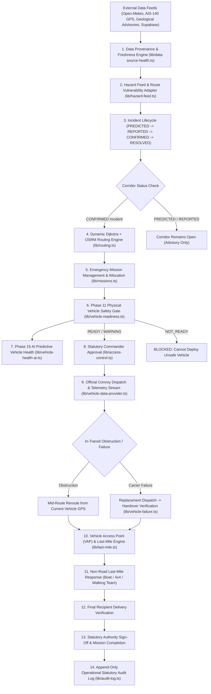

# NERA — COMPLETE SYSTEM ARCHITECTURE & GOVERNANCE MODEL

## 1. High-Level Architectural Flow

---

## 2. Architectural Layer Classification

| Layer | Type | Authority Scope | Responsibilities |
|---|---|---|---|
| **Layer 1: Deterministic Physical Safety** | `DETERMINISTIC` | Absolute | 8-point physical vehicle safety gate (`READY` / `NOT_READY`), finite depot inventory checks, zero phantom stock, strict Dijkstra/OSRM route geometry. |
| **Layer 2: AI Predictive Intelligence** | `AI ADVISORY` | Advisory Only | Weather disruption scoring, terrain landslide vulnerability, vehicle maintenance health risk (`LOW` to `CRITICAL`). **Never overrides physical safety or closes roads.** |
| **Layer 3: Human Administrative Authority** | `HUMAN AUTHORITY` | Statutory Sign-off | 8-role RBAC matrix (`COMMANDER`, `DISASTER_AUTHORITY`, etc.). Official disaster confirmation, mission dispatch approval, and mission completion. |

---

## 3. Data Provenance Standards

- `LIVE`: Verified external endpoint connected and updating within threshold (Open-Meteo, OSRM, Supabase).
- `STALE`: Outdated telemetry preserved at last known GPS coordinates without artificial drift.
- `OFFLINE`: Network disconnected; field reports buffered in local IndexedDB.
- `UNAVAILABLE`: Unconfigured external feeds explicitly labeled `DATA UNAVAILABLE` / `DATA INSUFFICIENT`.
- `SIMULATED`: Demonstration datasets explicitly labeled with `isSimulated: true`.

