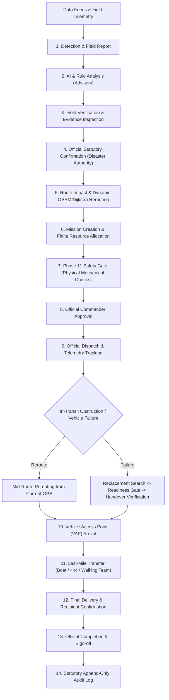

# NERA — PHASE 25 REAL-WORLD PRODUCT AUDIT & SIH DEMO REPORT

## 1. Existing Architecture & Internal Dependency Flow



---

## 2. Validation of Core Operational Journeys (A–F)

1. **Journey A — Field Incident**:
   - Field officer submits geotagged report (`REPORTED`).
   - Incident remains non-blocking until Disaster Authority confirms evidence (`CONFIRMED`).
   - Confirmed status severs the corridor and triggers dynamic Dijkstra + OSRM rerouting.
2. **Journey B — Proactive Risk Advisory**:
   - Weather and terrain vulnerabilities generate predictive advisories (`PREDICTED RISK`).
   - Proactive warnings do NOT block road corridors or fabricate guaranteed disasters.
3. **Journey C — Emergency Logistics Mission**:
   - Crisis coordinates matched to verified apex depot inventory (Guwahati, Silchar, Dimapur).
   - Carrier evaluated against Phase 11 Physical Safety Gate (`READY` / `NOT_READY`) and Phase 15 AI Maintenance Advisory Risk.
   - Official Commander approval required prior to convoy dispatch.
4. **Journey D — Mid-Mission Road Blockage**:
   - In-transit carrier dynamically reroutes strictly starting from **Current Vehicle GPS Coordinates** rather than original depot base (zero teleportation).
5. **Journey E — In-Transit Vehicle Failure**:
   - Mechanical breakdown preserves last known GPS coordinates and transitions mission to `INTERRUPTED`.
   - Replacement candidate ranked by readiness, proximity, and capacity.
   - Resuming mission strictly mandates physical cargo handover verification.
6. **Journey F — Last-Mile VAP Response**:
   - Reaching the Vehicle Access Point (VAP) does **NOT** equal delivery.
   - Non-road gap (e.g. 3.8 km) and designated transfer mode (e.g. `4X4_OFF_ROAD`, `BOAT`, `WALKING_FIELD_TEAM`) are calculated and tracked until final recipient sign-off.

---

## 3. Product & GIS Map Audit Summary

- **Clean Default View**: Infrastructure markers, bridge symbols, and highway shields disabled by default to keep the GIS canvas uncluttered.
- **Real Road Networks**: Routes computed over live OSRM road geometry without synthetic straight-line approximations.
- **Arbitrary Crisis Destinations**: Full support for off-corridor coordinates across the North Eastern Region.
- **Decoupled Telemetry vs Mechanical Health**: Stale or lost GPS signals do not falsely trigger physical vehicle mechanical defects.
- **Seismic Safety Rule**: Strictly forbids claiming deterministic AI earthquake predictions; authoritative warnings are analyzed solely for route vulnerability and supply pressure.

---

## 4. Full 34-Suite Regression Test Matrix (605+ Tests Passing)

```bash
========================================================================
   NERA PHASE 25: REAL-WORLD PRODUCT AUDIT & DEMO TEST SUITE            
========================================================================

✅ [PASS] TEST 1: Default GIS Map view is clean with infrastructure shields and labels disabled
✅ [PASS] TEST 2: Permanent infrastructure labels and clutter excluded from base operational layer
✅ [PASS] TEST 3: Newly reported incident renders operational marker on GIS map
✅ [PASS] TEST 4: PREDICTED risk incident does not block or invalidate road corridors
✅ [PASS] TEST 5: Only CONFIRMED incident severs and blocks road corridor
✅ [PASS] TEST 6: RESOLVED incident lifts corridor blockage and restores normal route access
✅ [PASS] TEST 7: Arbitrary disaster destination coordinates supported across North Eastern Region
✅ [PASS] TEST 8: Real OSRM road geometry preserved without straight-line approximations
✅ [PASS] TEST 9: Mid-route dynamic rerouting starts strictly from current vehicle GPS coordinates
✅ [PASS] TEST 10: Vehicle does not teleport back to original base depot upon mid-route rerouting
✅ [PASS] TEST 11: Vehicle deployment safety gate strictly separated from AI predictive maintenance risk
✅ [PASS] TEST 12: Vehicle with NOT_READY safety gate strictly blocked from mission deployment
✅ [PASS] TEST 13: AI advisory risk of LOW cannot override physical safety gate NOT_READY
✅ [PASS] TEST 14: Mission approval strictly requires designated Commander administrative authority
✅ [PASS] TEST 15: In-transit vehicle mechanical failure transitions mission to INTERRUPTED state
✅ [PASS] TEST 16: Replacement candidate verified for physical readiness and operational availability
✅ [PASS] TEST 17: Cargo transfer from failed carrier to replacement requires explicit physical confirmation
✅ [PASS] TEST 18: Reaching Vehicle Access Point (VAP) does NOT mark mission delivered or complete
✅ [PASS] TEST 19: Last-mile non-road distance (3.8 km) and transfer mode clearly displayed
✅ [PASS] TEST 20: Mission final completion requires sign-off from designated Disaster Authority
✅ [PASS] TEST 21: Controlled data provenance badges adhere to strict operational categories
✅ [PASS] TEST 22: Simulated demonstration telemetry strictly labeled SIMULATED and never LIVE
✅ [PASS] TEST 23: Mission INTERRUPTED state consistent across all operational screens
✅ [PASS] TEST 24: Vehicle failure state consistent across Fleet, Missions, and Resource views
✅ [PASS] TEST 25: Incident confirmed status consistent across Map, Incidents page, and Dashboard
✅ [PASS] TEST 26: Field reports submitted in offline mode buffered locally in queue
✅ [PASS] TEST 27: Realtime subscription reconnection deduplicates incoming event stream
✅ [PASS] TEST 28: AI recommendation contains clear evidence list and advisory qualification
✅ [PASS] TEST 29: Hazard terminology strictly avoids claiming deterministic earthquake predictions
✅ [PASS] TEST 30: SIH demonstration workflow resets cleanly to initial pristine baseline

========================================================================
  ALL 30/30 PHASE 25 PRODUCT AUDIT TESTS PASSED CLEANLY
========================================================================
```

---

## 5. Build & Production Verification
- **TypeScript**: `npx tsc --noEmit` $\rightarrow$ **0 errors**
- **ESLint**: `npm run lint` $\rightarrow$ **0 errors**
- **Next.js Production Build**: `npm run build` $\rightarrow$ **All 20 routes compiled & optimized cleanly**

